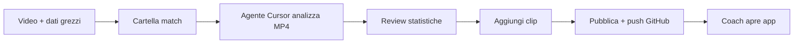

# Processo Settimanale — Analisi Partita

Questo documento descrive il flusso che useremo ogni settimana per aggiungere una nuova analisi partita.

---

## Panoramica



---

## Passo 1 — Prepara la cartella partita

### Opzione A: script automatico

```bash
npm run new-match -- \
  --date 2026-08-08 \
  --type campionato \
  --teams u19-vs-roma \
  --title "Napoli U19 vs Roma"
```

### Opzione B: chiedi all'agente Cursor

> "Crea una nuova partita per il campionato del 8 agosto, Napoli U19 vs Roma"

L'agente creerà la cartella in `matches/` con la struttura corretta.

### Cosa mettere nella cartella

```
matches/2026-08-08_campionato-u19-vs-roma/
├── video/
│   └── match.mp4          ← video completo partita (obbligatorio)
├── clips/                 ← clip singole (opzionale, si aggiungono dopo)
│   ├── gol-32.mp4
│   └── pressing-alto-15.mp4
└── (opzionale) notes.txt  ← appunti, distinta, dati grezzi
```

---

## Passo 2 — Analisi con Cursor

Apri una chat Cursor e scrivi qualcosa come:

> Analizza la partita in `matches/2026-08-08_campionato-u19-vs-roma/`.  
> Guarda il video MP4 e compila le statistiche in `match.json`.  
> Usa come riferimento il report amichevole già pubblicato.

### Cosa fa l'agente

1. **Legge il video MP4** — estrae frame, osserva eventi, tempi, azioni
2. **Compila `match.json`** — gol, timeline, formazioni, statistiche squadra, portieri
3. **Genera/aggiorna la pagina** — la partita appare automaticamente nell'app (nessun codice extra)
4. **Propone clip** — se identifica momenti chiave, suggerisce clip da tagliare

### Dati da fornire (se li hai)

- Distinta di gara / formazioni ufficiali
- Statistiche Wyscout / InStat / GPS
- Note del mister su cosa analizzare

L'agente integrerà questi dati con l'analisi video.

---

## Passo 3 — Review statistiche

Prima di pubblicare, controlla insieme all'agente:

- [ ] Risultato e marcatori corretti
- [ ] Timeline eventi (gol, sostituzioni, ingressi portieri)
- [ ] Formazioni e moduli
- [ ] Statistiche squadra (possesso, passaggi, duelli, ecc.)
- [ ] Analisi portieri (minuti, parate, gol subiti)
- [ ] Metriche tattiche (triangoli, compattezza, pressing)

Chiedi correzioni finché i numeri non tornano.

---

## Passo 4 — Clip di analisi

Per ogni clip:

1. Esporta il MP4 in `matches/<slug>/clips/nome-clip.mp4`
2. Aggiungi l'entry in `match.json` → array `clips` (ordine cronologico automatico per `minute`/`second`):

```json
{
  "id": "goal-esposito-32",
  "title": { "en": "Esposito goal", "it": "Gol Esposito" },
  "comments": {
    "en": "Build-up through the right half-space.",
    "it": "Costruzione dal half-space destro."
  },
  "minute": 32,
  "second": 14,
  "videoFile": "goal-esposito-32.mp4",
  "labels": ["goal", "build-up"],
  "tags": ["right half-space", "late run"]
}
```

**Labels controllate** (usare sempre queste): `goal`, `chance`, `build-up`, `pressing`, `defensive-transition`, `offensive-transition`, `set-piece`, `individual`, `tactical-pattern`, `gk-action`, `other`

**Tags** = commenti/keywords dell'analista (liberi).

### Video Analysis

Metti i video di analisi in `matches/<slug>/analysis/` e registrali in `analysisVideos`:

```json
{
  "id": "pressing-review",
  "title": { "en": "Pressing review", "it": "Review pressing" },
  "description": { "en": "First-half pressing structure.", "it": "Struttura pressing 1° tempo." },
  "videoFile": "pressing-review.mp4",
  "tags": ["pressing"]
}
```

Nell'app:
- **Full Match** — video completo
- **Clips** — sidebar cronologica + player + commenti
- **Video Analysis** — video lunghi dell'analista


---

## Passo 5 — Pubblica

1. In `match.json`, imposta `"status": "published"`
2. Verifica in locale: `npm run dev` → apri la partita
3. Push su GitHub:

```bash
git add matches/<slug>/match.json
git commit -m "Aggiunge analisi partita <slug>"
git push
```

> I file MP4 restano locali (o su Git LFS). L'app li legge dalla cartella `matches/` sul server dove fai deploy.

---

## Passo 6 — Coach accede all'app

Lo staff apre l'URL dell'app (locale o deploy) e trova:

- **Home** — elenco di tutte le partite
- **Pagina partita** — distinta, dashboard stats, video completo, clip con analisi

Niente più WeTransfer o link sparsi.

---

## Convenzione nomi cartella

| Formato | Esempio |
|---------|---------|
| `YYYY-MM-DD_<tipo>-<squadre>` | `2026-08-01_amichevole-u19-vs-u18` |
| | `2026-08-08_campionato-u19-vs-roma` |
| | `2026-08-15_coppa-u19-vs-lazio` |

Tipi comuni: `amichevole`, `campionato`, `coppa`, `playoff`

---

## Checklist settimanale

```
□ Creata cartella match (npm run new-match o agente)
□ MP4 completo in video/match.mp4
□ Agente ha analizzato video e compilato match.json
□ Review statistiche completata
□ Clip aggiunte (se necessario)
□ status = "published"
□ Push GitHub
□ Deploy aggiornato (se usato)
```

---

## Per l'agente Cursor (regola persistente)

Quando l'utente indica una cartella in `matches/`:

1. Leggi `match.json` e il video in `video/`
2. Analizza il MP4 (eventi, tempi, azioni tattiche)
3. Aggiorna `match.json` con dati completi
4. Non creare pagine React manuali — l'app legge automaticamente da `matches/*/match.json`
5. Per clip: aggiorna array `clips` e verifica che i file esistano in `clips/`
6. Chiedi conferma prima di impostare `status: published`
