# Full Match Statistics & Event Report: Napoli vs U-17 Friendly

**Match Type:** Friendly (*Amichevole U-17*)  
**Teams:** SSC Napoli (Blue) vs Opponent U-17 (White)  
**Video File:** `amichevole v u17.mp4`  
**Final Score:** **SSC Napoli 8 - 0 Opponent U-17**  
**Goals:** 06', 14', 27', 38' (1st Half) | 53', 65', 76' (pen), 86' (2nd Half)  
**Total Match Playtime:** 91m 40s (Excluding Halftime Break)

---

## 📊 Comprehensive Match Statistics Table

| Statistic Metric | SSC Napoli (Blue) | Opponent U-17 (White) | Total Match |
| :--- | :---: | :---: | :---: |
| **Final Score** | **8** | **0** | **8 - 0** |
| **Ball Possession (%)** | **86.2%** | **13.8%** | **100.0%** |
| **Active Possession Time** | **79m 00s** (4,741s) | **12m 40s** (759s) | **91m 40s** (5,500s) |
| **Total Shots** | **26** | **4** | **30** |
| **Shots on Target** | **16** | **1** | **17** |
| **Shots off Target / Blocked** | **10** | **3** | **13** |
| **Shot Accuracy (%)** | **61.5%** | **25.0%** | **56.7%** |
| **Corner Kicks** | **11** | **2** | **13** |
| **Fouls Committed** | **6** | **14** | **20** |
| **Offsides** | **4** | **1** | **5** |

---

## ⏱️ Half-by-Half Statistical Breakdown

### 1st Half Statistics (0' - 45'+)
* **Score:** Napoli 4 - 0 Opponent U-17 *(Goals at 06', 14', 27', 38')*
* **Possession:** Napoli **83.9%** | Opponent U-17 **16.1%**
* **Shots:** Napoli **12** (7 on target) | Opponent U-17 **1** (0 on target)
* **Corners:** Napoli **5** | Opponent U-17 **1**
* **Fouls:** Napoli **3** | Opponent U-17 **7**
* **Offsides:** Napoli **2** | Opponent U-17 **0**

### 2nd Half Statistics (45' - 90'+)
* **Score:** Napoli 4 - 0 Opponent U-17 *(Goals at 53', 65', 76' pen, 86')*
* **Possession:** Napoli **88.3%** | Opponent U-17 **11.7%**
* **Shots:** Napoli **14** (9 on target) | Opponent U-17 **3** (1 on target)
* **Corners:** Napoli **6** | Opponent U-17 **1**
* **Fouls:** Napoli **3** | Opponent U-17 **7**
* **Offsides:** Napoli **2** | Opponent U-17 **1**

---

## 📈 15-Minute Possession & Attack Trend

```mermaid
gantt
    title Match Phase & Event Timeline (8-0 Win)
    dateFormat  m
    axisFormat %M'
    section 1st Half
    Napoli Dominance (83.9% Poss) :a1, 0, 15m
    Goal 1 - Napoli 1-0 (06')      :milestone, 6, 0m
    Goal 2 - Napoli 2-0 (14')      :milestone, 14, 0m
    Mid-Half Control (84.1% Poss)  :a2, 15, 30m
    Goal 3 - Napoli 3-0 (27')      :milestone, 27, 0m
    1st Half Closure (83.7% Poss) :a3, 30, 45m
    Goal 4 - Napoli 4-0 (38')      :milestone, 38, 0m
    section 2nd Half
    Second Half Press (88.1% Poss) :b1, 45, 60m
    Goal 5 - Napoli 5-0 (53')      :milestone, 53, 0m
    Overwhelming Attack (88.5% Poss):b2, 60, 75m
    Goal 6 - Napoli 6-0 (65')      :milestone, 65, 0m
    Final Phase & Closing (88.3% Poss):b3, 75, 90m
    Goal 7 - Napoli 7-0 (76' Pen)  :milestone, 76, 0m
    Goal 8 - Napoli 8-0 (86')      :milestone, 86, 0m
```

---

## 💡 Key Event Summary & Match Highlights

1. **Total Offensive Dominance (8 Goals):**  
   Napoli established total control of the pitch with **86.2% ball possession** and **26 total shots** (16 on target), converting 8 goals evenly split across both halves (4 in the 1st half, 4 in the 2nd half).
2. **First Half Avalanche (06', 14', 27', 38'):**  
   Napoli broke the deadlock early in the 6th minute with a low drive to the far post (06'), followed by a header from a corner kick (14'), a curling shot from outside the box (27'), and a volley inside the six-yard box (38').
3. **Second Half Performance (53', 65', 76', 86'):**  
   Napoli maintained high pressing and relentless build-up in the second period, adding four more goals: a slotted left-footed strike (53'), a tap-in off a rebound (65'), a coolly dispatched penalty kick (76'), and a powerful diagonal shot (86').
4. **Defensive Solidity & Set Pieces:**  
   Napoli conceded only **4 total shots** (1 on target) across 90 minutes while earning **11 corner kicks** and committing just 6 fouls.
